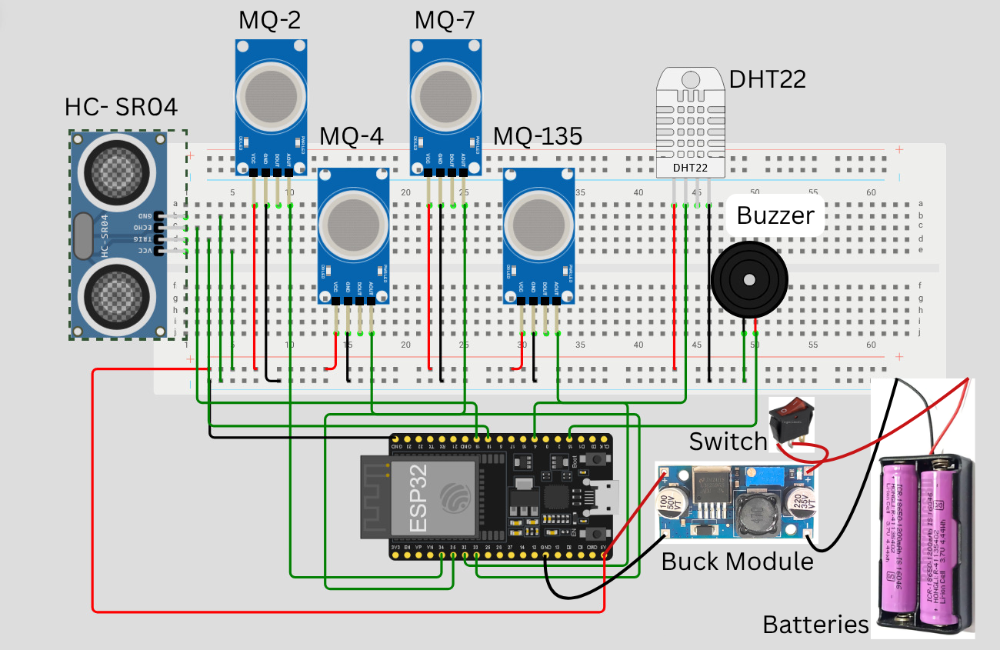
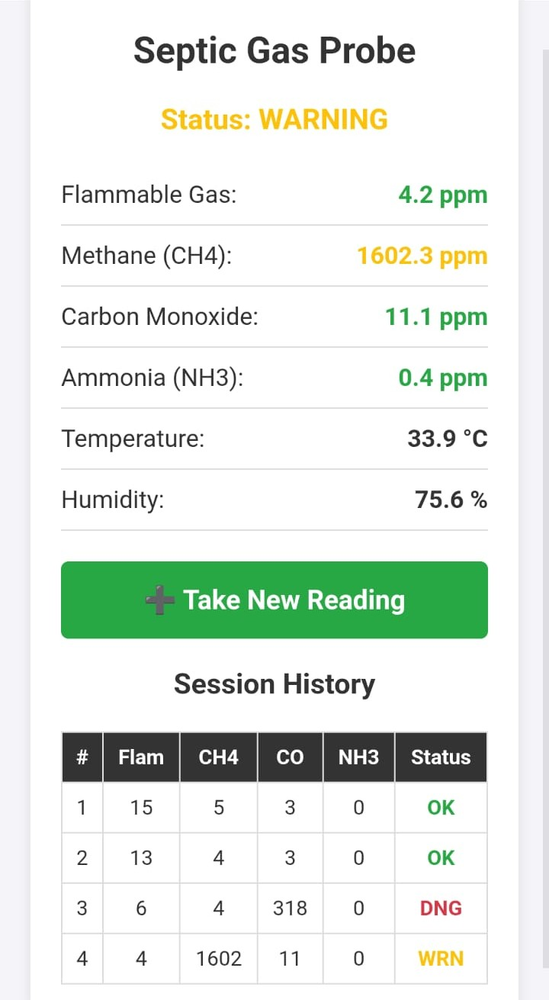

# 🛢️ A Low-Cost Multi-Gas Monitoring System for Occupational Hazard Assessment in Confined Septic Spaces: Concentration Profiling and Environmental Correlation

A portable, Wi-Fi-enabled multi-gas monitoring device designed to assess occupational hazards in confined septic spaces. Built around the ESP32 microcontroller, the system performs real-time concentration profiling of toxic and flammable gases and presents results via an on-device web dashboard.

> **Course:** Microprocessor and Microcontroller Laboratory (CSE-2104)  
> **Institution:**  Department of CSE, Khulna University of Engineering & Technology (KUET)

---

## 👥 Authors

| Name | Roll |
|---|---|
| Md. Wasif Rahman | 2307101 |
| MD Rashed Shariar | 2307109 |

**Supervised by:**
- Md. Sakhawat Hossain — Assistant Professor, CSE, KUET
- Md Tajmilur Rahman — Lecturer, CSE, KUET

---

## 📋 Overview

Workers who enter septic tanks and confined underground spaces face life-threatening exposure to toxic gases such as hydrogen sulfide, methane, and carbon monoxide, often without any warning. This project builds a **low-cost, self-contained probe** that can be lowered into a septic tank to measure gas concentrations before or during entry, protecting workers from invisible hazards.

---

## ✨ Features

- **Multi-gas detection** — simultaneously monitors flammable gas, methane (CH4), carbon monoxide (CO), and ammonia (NH3)
- **Environmental sensing** — measures temperature and humidity via DHT22
- **Depth detection** — HC-SR04 ultrasonic sensor with active buzzer guides the operator to the optimal 15–30 cm "sweet spot" above the liquid surface
- **Wi-Fi dashboard** — ESP32 hosts a local access point; results are displayed on a mobile-friendly webpage
- **Fault-tolerant FSM architecture** — measurement and web-server logic are decoupled, so data is never lost even if the client disconnects mid-measurement
- **Battery powered** — portable and field-ready with a buck converter for regulated power

---

## 🔩 Hardware Components

| Component | Purpose |
|---|---|
| ESP32 | Main microcontroller + Wi-Fi AP |
| MQ-2 | Flammable gas / LPG / smoke detection |
| MQ-4 | Methane (CH4) detection |
| MQ-7 | Carbon monoxide (CO) detection |
| MQ-135 | Ammonia (NH3) / air quality detection |
| DHT22 | Temperature & humidity sensing |
| HC-SR04 | Ultrasonic depth measurement |
| Buzzer | Auditory depth alert to operator |
| Buck Converter | Voltage regulation from battery |
| 18650 Batteries | Portable power supply |
| Toggle Switch | System on/off |

---

## 🔌 Circuit Overview

All gas sensors (MQ-2, MQ-4, MQ-7, MQ-135), the DHT22, HC-SR04, and buzzer are wired to the ESP32 on a breadboard. The system is powered by 18650 lithium cells stepped down to 3.3 V/5 V via a buck converter module, with an inline toggle switch for field operation.

---

## 🚀 Getting Started

### Prerequisites

- Arduino IDE with ESP32 board support installed
- Required libraries: `DHT sensor library`, `WiFi.h`, `WebServer.h`

### Flashing the Firmware

1. Clone this repository
2. Open the `.ino` sketch in Arduino IDE
3. Select the correct ESP32 board and COM port
4. Upload the sketch

### Operating the Device

1. Fully charge the batteries, then power on using the side switch.
2. On your smartphone or laptop, connect to the Wi-Fi network:
   - **SSID:** `GasProbe_AP`
   - **Password:** `password123`
3. Open a browser and navigate to `192.168.4.1`.
4. Wait for the **60-second calibration phase** to complete.
5. Slowly lower the probe into the septic tank. The buzzer will sound when the probe reaches the 15–30 cm sweet spot above the liquid level — stop lowering here.
6. The probe takes readings for **10 seconds**, then automatically pulls averages.
7. The final dashboard displays average PPM readings for all four gases, plus temperature and humidity.
8. Press **Reset & Measure Again** on the webpage to start a new measurement cycle.

---

## 🌐 Web Interface

The ESP32 serves a self-hosted dashboard at `192.168.4.1`:

  

---

## 🧠 System Architecture

The firmware runs as a **Finite State Machine (FSM)** with the following states:

| State | Description |
|---|---|
| `STATE_CALIBRATING` | 60-second warm-up for MQ sensors |
| `STATE_LOWERING` | HC-SR04 monitors depth; buzzer alerts at 15 cm floor |
| `STATE_MEASURING` | 10-second averaging window for all sensors |
| `STATE_DONE` | Final readings locked in memory; dashboard served |

The web server (`server.handleClient()`) runs independently of the FSM, so a Wi-Fi disconnection during measurement cannot cause a buffer overflow or data loss. The final reading remains in memory until a reset is issued.

---

## ⚠️ Safety Considerations

- The system is a **supplementary tool** and does not replace professional gas monitoring equipment or safety protocols.
- Always follow site-specific confined space entry procedures and local occupational health regulations.
- The MQ-series sensors require periodic recalibration in known reference gas conditions for accurate PPM readings.
- Do not submerge the probe below the liquid level; the buzzer alarm is specifically designed to prevent accidental submersion.

---

## 📄 License

This project was developed for academic purposes at KUET. Feel free to use, modify, and build upon it with appropriate attribution.
